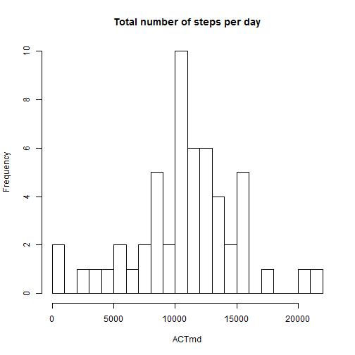
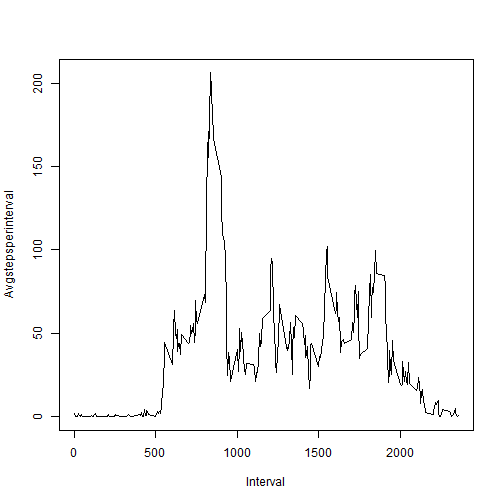
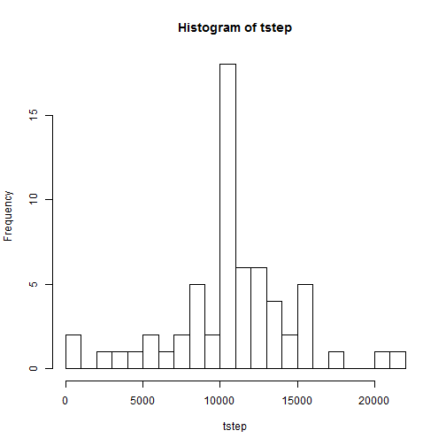
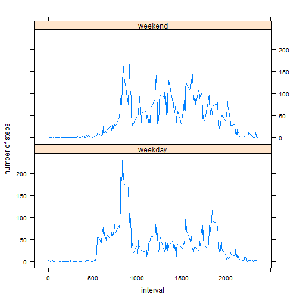

## Loading and preprocessing the data


```r
temp <- tempfile()

download.file("http://d396qusza40orc.cloudfront.net/repdata%2Fdata%2Factivity.zip",temp)
unzip(temp)
ACT <- read.csv("activity.csv")

unlink(temp) 
```

## What is mean total number of steps taken per day?

```r
ACTmd<-tapply(ACT$step, ACT$date, sum)
hist(ACTmd,breaks=20, main="Total number of steps per day")
```

 

```r
meansds<-summary(ACTmd)
meansds
```

```
##    Min. 1st Qu.  Median    Mean 3rd Qu.    Max.    NA's 
##      41    8841   10760   10770   13290   21190       8
```

```r
meansd<-meansds["Mean"]
meansd
```

```
##  Mean 
## 10770
```

```r
meansds["Median"]
```

```
## Median 
##  10760
```


## What is the average daily activity pattern?


```r
timei<-tapply(ACT$step,ACT$interval,mean,na.rm=TRUE)
plot(timei,x=names(timei),type="l",ylab="Avgstepsperinterval", xlab="Interval")
```

 

```r
s<-sort(timei)
max<-s[length(s)]
max
```

```
##      835 
## 206.1698
```
## Imputing missing values

```r
na<-is.na(ACT)
sum(na)
```

```
## [1] 2304
```
###Here is the strategy to filling NAs,filling NAs with the mean for the 5-minute interval and create a dataset new


```r
meani <- aggregate(ACT$step ~ interval, data=ACT, mean)
names(meani)[2] <- "meanstep"
com <- merge(ACT, meani)
com$step[is.na(com$step)] <- com$meanstep[is.na(com$step)]
com$meanstep <- NULL
```


```r
com1<-com[,c(4,3,1)]

newdata<-com1[order(com1$date,com1$interval),]  
head(newdata)
```

```
##          step       date interval
## 1   1.7169811 2012-10-01        0
## 63  0.3396226 2012-10-01        5
## 128 0.1320755 2012-10-01       10
## 205 0.1509434 2012-10-01       15
## 264 0.0754717 2012-10-01       20
## 327 2.0943396 2012-10-01       25
```
###Histogram of total steps each day and mean and median of total steps.


```r
tstep<-tapply(newdata$step, newdata$date, sum)
hist(tstep, breaks=20)
```

 

```r
s<-summary(tstep)
s["Mean"]
```

```
##  Mean 
## 10770
```

```r
s["Median"]
```

```
## Median 
##  10770
```
Conclusion:The mean didn't change after filling the NAs with mean value of non-NA dataset; The median increased a little bit.

## Are there differences in activity patterns between weekdays and weekends?

```r
newdata$wd<-weekdays(as.Date(newdata$date))
newdata$wdate=ifelse((newdata$wd=="Sunday"|newdata$wd=="Saturday"), "weekend", "weekday")
tail(newdata,20)
```

```
##            step       date interval     wd   wdate
## 16386 7.0754717 2012-11-30     2220 Friday weekday
## 16428 8.6981132 2012-11-30     2225 Friday weekday
## 16472 9.7547170 2012-11-30     2230 Friday weekday
## 16551 2.2075472 2012-11-30     2235 Friday weekday
## 16645 0.3207547 2012-11-30     2240 Friday weekday
## 16689 0.1132075 2012-11-30     2245 Friday weekday
## 16729 1.6037736 2012-11-30     2250 Friday weekday
## 16799 4.6037736 2012-11-30     2255 Friday weekday
## 16853 3.3018868 2012-11-30     2300 Friday weekday
## 16949 2.8490566 2012-11-30     2305 Friday weekday
## 17017 0.0000000 2012-11-30     2310 Friday weekday
## 17074 0.8301887 2012-11-30     2315 Friday weekday
## 17088 0.9622642 2012-11-30     2320 Friday weekday
## 17193 1.5849057 2012-11-30     2325 Friday weekday
## 17242 2.6037736 2012-11-30     2330 Friday weekday
## 17305 4.6981132 2012-11-30     2335 Friday weekday
## 17364 3.3018868 2012-11-30     2340 Friday weekday
## 17441 0.6415094 2012-11-30     2345 Friday weekday
## 17506 0.2264151 2012-11-30     2350 Friday weekday
## 17568 1.0754717 2012-11-30     2355 Friday weekday
```

```r
means<-aggregate(step~interval+wdate,data=newdata,FUN=mean)
       head(means)
```

```
##   interval   wdate       step
## 1        0 weekday 2.25115304
## 2        5 weekday 0.44528302
## 3       10 weekday 0.17316562
## 4       15 weekday 0.19790356
## 5       20 weekday 0.09895178
## 6       25 weekday 1.59035639
```

```r
        tail(means)        
```

```
##     interval   wdate        step
## 571     2330 weekend  1.38797170
## 572     2335 weekend 11.58726415
## 573     2340 weekend  6.28773585
## 574     2345 weekend  1.70518868
## 575     2350 weekend  0.02830189
## 576     2355 weekend  0.13443396
```
###Panel plot compare the average steps per 5 minute between weekdays and weekends


```r
        library(grid)
        library (lattice)
p<-xyplot(step~interval|wdate, type="l", data=means, ylab="number of steps",layout=c(1,2) )
        print(p)
```

 

According to the plot, the activity patterns between weekdays and weekend are slightly different in the miidle intervals.
